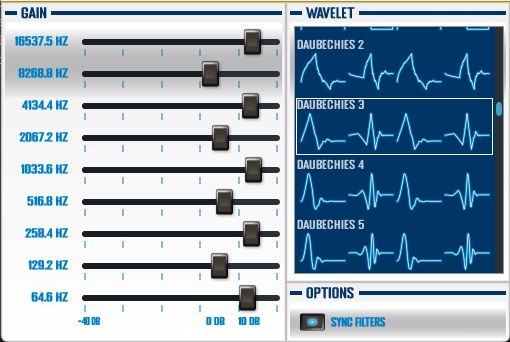

 
**Wavelet based parametric equalizer**

Soundlet is a wavelet based parametric equalizer. Why? Because we can!

## What are wavelets?

Wavelets are a way to decompose (and reconstruct) a signal into different freqeuncy components. Wavelets are more often used in image processing, but can be applied to audio signals as well. In comparison to a normal parametric equalizer, wavelets do not split into clear frequency bins. 

## How does soundlet work?

Soundlet uses different wavelet filter banks (i.e. 'frequencie bands') and applies a different gain per bank. The wavelet to apply is user selectable.

Note that soundlet is limited to power-of-two divisions of your sample rate. Thus when outputing 44.1 kilo-samples-per-second, the first bin runs from 22050 Hz to 11025 Hz (having a center frequencty of 16537.5 Hz). The second bin goes from 11026 to 5513 Hz, etc...

Each filter bank has its own sample rate. Normally Soundlet adds delays to the specific filter banks to compensate for the lower sample rate of the lower banks. However, unchecking 'sync filters' will remove this delay. 

## How does it sound?

**No Ordinary Morning - Chicane**

*  
* 

**Guitar loop**

*  
* 

(borrowed from [free sound](https://freesound.org/people/sepal/sounds/96481/))

## FAQ

**Q.** Could you not just use JUCE convolution? 
**A.** Probably, but I wanted to make my own processing.
